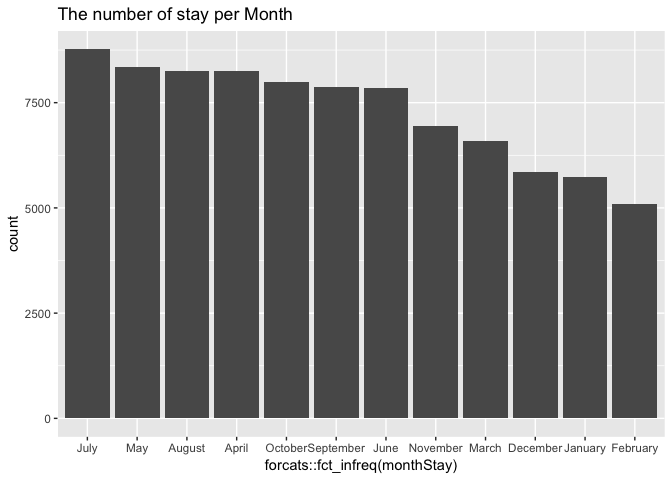
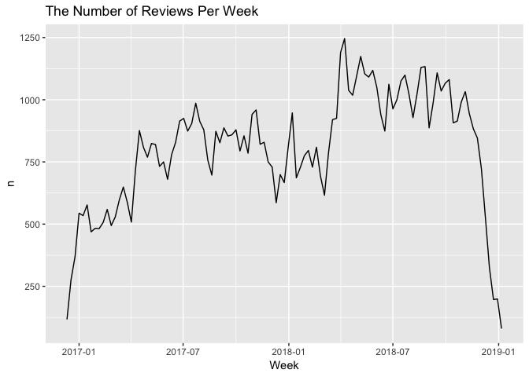
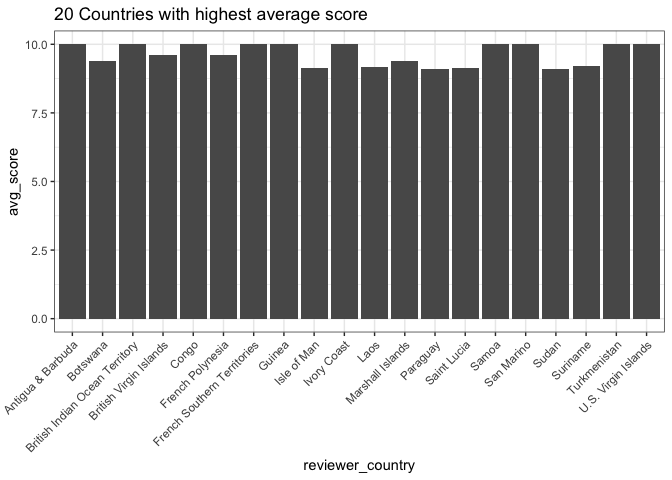
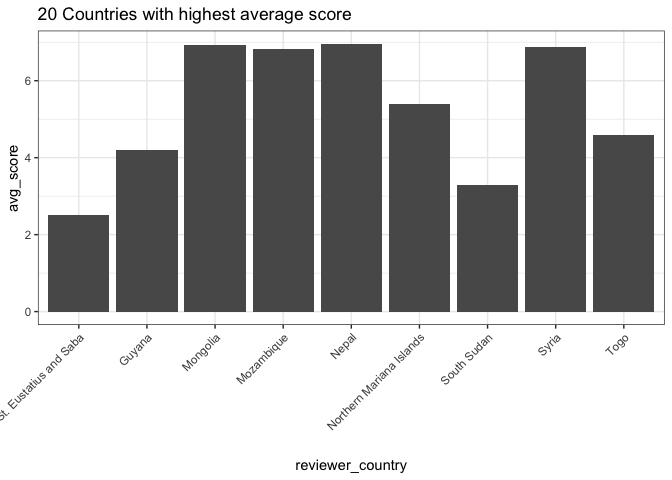
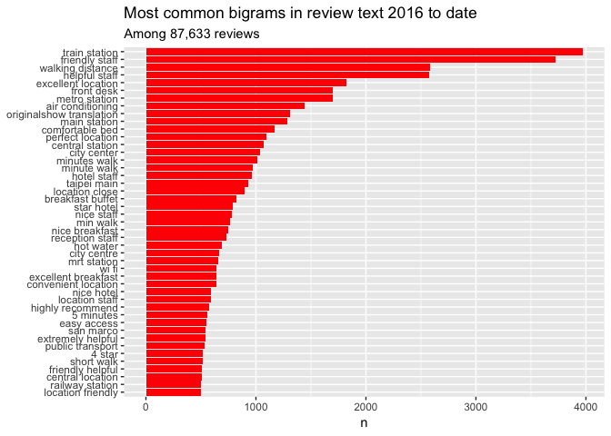
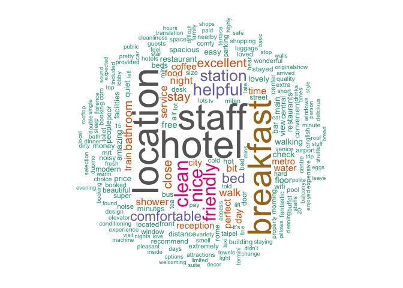
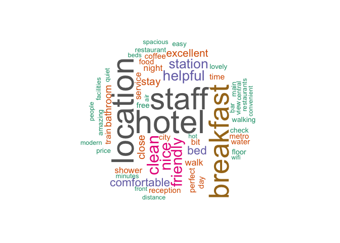

Independent Study
================

In this report I perform text analysis of the publicly available review data posted on Booking for the major turistic italian cities: Milan, Rome, Florence Venice and Verona.
==============================================================================================================================================================================

Below are some of the key findings.
-----------------------------------

Load the libraries
==================

``` r
library(sqldf)
library(NLP)
library(dplyr)
library(readr)
library(tidytext)
library(tidyverse)
library(stringr)
library(tidyr)
library(scales)
library(igraph)
library(ggraph)
library(SnowballC)
library(wordcloud)
library(reshape2)
library(lubridate)
library(ggplot2)
library(widyr)
library(igraph)
library(ggraph)
```

``` r
head(en_reviewResponse)
```

    ##   X                        hotelid reviewer_name reviewer_country
    ## 1 1 /hotel/it/romagna-firenze.html        Albert        Indonesia
    ## 2 2 /hotel/it/romagna-firenze.html      Campbell   United Kingdom
    ## 3 3 /hotel/it/romagna-firenze.html         Julie        Australia
    ## 4 4 /hotel/it/romagna-firenze.html           Eve          Estonia
    ## 5 5 /hotel/it/romagna-firenze.html        Frisca            Italy
    ## 6 6 /hotel/it/romagna-firenze.html  Richardnohra            Spain
    ##                                                                               review_title
    ## 1                                                                                Excellent
    ## 2                                                                              Exceptional
    ## 3                                                                               Great spot
    ## 4                                                                   Never this hotel again
    ## 5                                                                                     Okay
    ## 6 Except for the location, nothing went as we expected, even though we didn’t expect much.
    ##                    review_date                stay_date review_score
    ## 1       Reviewed: May 17, 2018       Stayed in May 2018          8.8
    ## 2     Reviewed: April 25, 2018     Stayed in April 2018          9.6
    ## 3     Reviewed: March 29, 2018     Stayed in March 2018          7.1
    ## 4 Reviewed: September 27, 2018 Stayed in September 2018          6.2
    ## 5      Reviewed: April 5, 2018                                   5.6
    ## 6     Reviewed: March 16, 2018     Stayed in March 2018          6.2
    ##                                                                                                                                                                                                                                                                                                                                                                                                                                                                                                                                                         fullText
    ## 1                                                                                                                                                                                                                                                                                                                                                                                                                                                                                                 armando the receptionist was extraordinarily helpful. no lift.
    ## 2                                                                                                                                                                                                                                                                                                                                                                           Great friendly staff who were very helpful in pointing out good places to eat. Including directions to the best gelato place. Amazing location and the staff made the trip easier.  
    ## 3                                                                                                                                                                                                                                                                                                                                                                                                                                                                                                                   Great position Rooms old and tired but clean
    ## 4                                                                                                                                                                                                                                                                                                                                                                                                                                                                                                      Location was perfect. Very small room, too high stairway.
    ## 5                                                                                                                                                                                                                                                                                                                                                                                 no elevator and no assistance from the hotel for luggages as the family stayed at the 4th floorbathroom is too narrow for which you need sit on toilet bowl and bidet sideways
    ## 6 The location. It’s in the heart of Florence, very close to the Cathedral. Internet connection was extremely slow. Very frustrating. The parking is not in the same building and it doesn’t belong to the hotel; so someone comes and take the car to a parking somewhere in the city. The room was too noisy due to renovation in an adjacent building. It woke us up very early in the morning. We went for breakfast at 9:27 and there was nothing to have. They had closed and collected all the food at 9:20, when they are supposed to be open till 9:30.
    ##                                                                                                                                                                                                                                                                                                                                                                                                                                                                                                                                                                                                                                                                                                                                                                                                                                                                                                                                                                                                    response
    ## 1                                                                                                                                                                                                                                                                                                                                                                                                                                                                                                                                                                                                                                                                                                                                                                                                                                                                                  Thank you Albert,We are glad that you enjoyed your stay at hotel Romagna.Still waiting for the key :)Best regardsArmando
    ## 2                                                                                                                                                                                                                                                                                                                                                                                                                                                                                                                                                                                                                                                                                                                                                                                            Dear Shaida,Thanks for your review. We are very glad that you enjoyed your stay at hotel Romagna. These satisfactions push us to commit ourselves more and more to improve our hospitality.Best regardsArmando
    ## 3                                                                                                                                                                                                                                                                                                                                                                                                                                                                                                         Dear Julie,Thank you for your review. I still remember your exact words at your departure: "Thank you for everything, it was truly a wonderful stay. Perfect room perfect location, everything we needed ...ecc"  What happened next?I prefer to think that your words were sincere and for some other reason you have changed your mind. Maybe the fact that you forgot your glasses, or maybe I did not thank you enough. In any case, I wish you the best. You are nice people.Regards,Armando
    ## 4                                                                                                                                                                                                                                                                        Dear Eve,Let me give you a useful tip for the next time you book a hotel.As you want a large room, better hotel with a lift but a small price instead of booking a economy room in a two-star hotel, just 100 m from the cathedral. You should search 5-10km outside the city center, maybe even at the same price you can also find 3-4 star hotels with elevator. Maybe instead of an economy room you can  find a standard or superior room. You will lose 2-3 hours of your time every time you want to reach the city center by public transport, but at least you will have a better hotel with an elevator and a larger room at the same price.When you make a choice, give priority to your essential needs.RegardsArmando
    ## 5                                                                                                                                                                                                                                                                         Thank you for your review. We are very sorry to see your negative judgment but even more in reading so many unacceptable lies. On the day of check-in, my colleague who took care of your welcome brought your 4 luggage to the fourth floor. The next day you pretended that the sheets should be changed every day. Although in all two-star hotels are changed every 2-3 days, we satisfied your needs with pleasure. On the day of check-out I brought all your luggage downstairs from the fourth floor, and all of you with big smiles left even a tip. In the Philippines, maybe 2-star hotels are much better. I have yet to come visit. But a minimum of respect for the work of others never hurts.Best regards,Armando
    ## 6 Dear Richard,Thank you for  staying at hotel Romagna and for your review.Although personally, it seems a little unfair to me.We renewed the wifi access a few months ago and I assure you that they work very well, if you have had problems with your device you should have simply asked our staff for help. 24 hours available.The fact that we offer valet parking does not seem to me a negative point but an extra service that we offer to our guests.Must know that inside the historic center there is no private parking even the 5-star hotels.For breakfast we have flexibility of time until 10.00am, if you did not find food at your arrival in the breakfast room, evidently at 9.27 am it was already finished. But if you would have asked the staff I'm sure they would have prepared something just for you. Communication is the key to everything. We manage 40-45 guests every day and we do not have superpowers but we are ready to listen and help everyone.Best RegardsArmando
    ##   helpfulvote     city reviewID
    ## 1          NA Florence       63
    ## 2          NA Florence       75
    ## 3          NA Florence       84
    ## 4          NA Florence      171
    ## 5          NA Florence      188
    ## 6          NA Florence      190

Update stay date to a date format
=================================

``` r
toremoveStay = c("Stayed in ")

gsub(paste0(toremoveStay,collapse = "|"),"", en_reviewResponse$stay_date)
en_reviewResponse$stay_date <- gsub(paste0(toremoveStay,collapse = "|"),"", en_reviewResponse$stay_date)

library(lubridate)
en_reviewResponse$stay_date <- as.Date(paste('01', en_reviewResponse$stay_date), format='%d %b %Y')
```

Update review date to a date format
===================================

``` r
toremove = c("Reviewed: ")

gsub(paste0(toremove,collapse = "|"),"", en_reviewResponse$review_date)
en_reviewResponse$review_date <- gsub(paste0(toremove,collapse = "|"),"", en_reviewResponse$review_date)

require(devtools)
install_github("Displayr/flipTime")
library(flipTime)
en_reviewResponse$review_date <- AsDate(en_reviewResponse$review_date)
```

There were 87633, 13 english reviews in Booking for the hotels in the main italian cities. The review date ranges from `min(en_reviewResponse$review_date); max(en_reviewResponse$review_date)`

``` r
en_reviewResponse$monthStay <- as.character(format(en_reviewResponse$stay_date,'%B'))

en_reviewResponse[!is.na(en_reviewResponse$monthStay),] %>% 
  ggplot(aes(x = forcats::fct_infreq(monthStay))) +
  geom_bar() + 
  ggtitle('The number of stay per Month')
```



``` r
#The highest number of weekly reviews was received within the half of 2018. The hotels received almost 1250 reviews in that week. 
en_reviewResponse %>%
  count(Week = round_date(review_date, "week")) %>%
  ggplot(aes(Week, n)) +
  geom_line() + 
  ggtitle('The Number of Reviews Per Week')
```



20 Countries with highest average score
=======================================

``` r
avgscore_nation <- sqldf('SELECT reviewer_country, avg(review_score) as avg_score from en_reviewResponse group by reviewer_country order by avg(review_score) desc')

ggplot(avgscore_nation[1:20,],aes(x=reviewer_country, y=avg_score)) + geom_bar(stat = 'identity')+theme_bw()+ theme(axis.text.x = element_text(angle = 45, hjust = 1)) + ggtitle('20 Countries with highest average score')
```



Italian average score nation
============================

``` r
it_avgScore <- avgscore_nation %>% filter(reviewer_country == 'Italy')
```

Countries with lowest average score
===================================

``` r
ggplot(avgscore_nation[183:191,],aes(x=reviewer_country, y=avg_score)) + geom_bar(stat = 'identity')+theme_bw()+ theme(axis.text.x = element_text(angle = 45, hjust = 1)) + ggtitle('20 Countries with highest average score')
```



We often want to understand the relationship between words in a review. What sequences of words are common across review text? Given a sequence of words, what word is most likely to follow? What words have the strongest relationship with each other? Therefore, many interesting text analysis are based on the relationships. When we exam pairs of two consecutive words, it is called “bigrams”.
========================================================================================================================================================================================================================================================================================================================================================================================================

What are the most common bigrams in our reviews?
------------------------------------------------

``` r
review_bigrams <- en_reviewResponse %>%
  unnest_tokens(bigram, fullText, token = "ngrams", n = 2)

bigrams_separated <- review_bigrams %>%
  separate(bigram, c("word1", "word2"), sep = " ")
bigrams_filtered <- bigrams_separated %>%
  filter(!word1 %in% stop_words$word) %>%
  filter(!word2 %in% stop_words$word)

bigram_counts <- bigrams_filtered %>% 
  count(word1, word2, sort = TRUE)
bigrams_united <- bigrams_filtered %>%
  unite(bigram, word1, word2, sep = " ")
bigrams_united %>%
  count(bigram, sort = TRUE) %>% 
  head(15)
```

    ## # A tibble: 15 x 2
    ##    bigram                       n
    ##    <chr>                    <int>
    ##  1 train station             3969
    ##  2 friendly staff            3722
    ##  3 walking distance          2586
    ##  4 helpful staff             2573
    ##  5 excellent location        1822
    ##  6 front desk                1702
    ##  7 metro station             1697
    ##  8 air conditioning          1442
    ##  9 originalshow translation  1309
    ## 10 main station              1287
    ## 11 comfortable bed           1171
    ## 12 perfect location          1099
    ## 13 central station           1071
    ## 14 city center               1041
    ## 15 minutes walk              1015

``` r
bigrams_united %>%
  count(bigram, sort = TRUE) %>%
  filter(n > 500) %>%
  mutate(bigram = reorder(bigram, n)) %>%
  ggplot(aes(bigram, n)) +
  geom_col(fill = "red") +
  xlab(NULL) +
  coord_flip() +
  labs(title = "Most common bigrams in review text 2016 to date",
       subtitle = "Among 87,633 reviews")
```



Visualize bigrams in word networks:
===================================

``` r
review_subject <- en_reviewResponse %>%
  unnest_tokens(word, fullText, token = "ngrams", n = 1) %>% 
  anti_join(stop_words)

my_stopwords <- data_frame(word = c(as.character(1:10)))
review_subject <- review_subject %>% 
  anti_join(my_stopwords)

title_word_pairs <- review_subject %>% 
  pairwise_count(word, reviewID, sort = TRUE, upper = FALSE)
set.seed(1234)
title_word_pairs %>%
  filter(n >= 3000) %>%
  graph_from_data_frame() %>%
  ggraph(layout = "fr") +
  geom_edge_link(aes(edge_alpha = n, edge_width = n), edge_colour = "cyan4") +
  geom_node_point(size = 5) +
  geom_node_text(aes(label = name), repel = TRUE, 
                 point.padding = unit(0.2, "lines")) +
  ggtitle('Word network in Booking reviews')
```



``` r
  theme_void()
```

    ## List of 22
    ##  $ line                 : list()
    ##   ..- attr(*, "class")= chr [1:2] "element_blank" "element"
    ##  $ rect                 : list()
    ##   ..- attr(*, "class")= chr [1:2] "element_blank" "element"
    ##  $ text                 :List of 11
    ##   ..$ family       : chr ""
    ##   ..$ face         : chr "plain"
    ##   ..$ colour       : chr "black"
    ##   ..$ size         : num 11
    ##   ..$ hjust        : num 0.5
    ##   ..$ vjust        : num 0.5
    ##   ..$ angle        : num 0
    ##   ..$ lineheight   : num 0.9
    ##   ..$ margin       : 'margin' num [1:4] 0pt 0pt 0pt 0pt
    ##   .. ..- attr(*, "valid.unit")= int 8
    ##   .. ..- attr(*, "unit")= chr "pt"
    ##   ..$ debug        : logi FALSE
    ##   ..$ inherit.blank: logi TRUE
    ##   ..- attr(*, "class")= chr [1:2] "element_text" "element"
    ##  $ axis.title           : list()
    ##   ..- attr(*, "class")= chr [1:2] "element_blank" "element"
    ##  $ axis.text            : list()
    ##   ..- attr(*, "class")= chr [1:2] "element_blank" "element"
    ##  $ axis.ticks.length    : 'unit' num 0pt
    ##   ..- attr(*, "valid.unit")= int 8
    ##   ..- attr(*, "unit")= chr "pt"
    ##  $ legend.key.size      : 'unit' num 1.2lines
    ##   ..- attr(*, "valid.unit")= int 3
    ##   ..- attr(*, "unit")= chr "lines"
    ##  $ legend.text          :List of 11
    ##   ..$ family       : NULL
    ##   ..$ face         : NULL
    ##   ..$ colour       : NULL
    ##   ..$ size         : 'rel' num 0.8
    ##   ..$ hjust        : NULL
    ##   ..$ vjust        : NULL
    ##   ..$ angle        : NULL
    ##   ..$ lineheight   : NULL
    ##   ..$ margin       : NULL
    ##   ..$ debug        : NULL
    ##   ..$ inherit.blank: logi TRUE
    ##   ..- attr(*, "class")= chr [1:2] "element_text" "element"
    ##  $ legend.title         :List of 11
    ##   ..$ family       : NULL
    ##   ..$ face         : NULL
    ##   ..$ colour       : NULL
    ##   ..$ size         : NULL
    ##   ..$ hjust        : num 0
    ##   ..$ vjust        : NULL
    ##   ..$ angle        : NULL
    ##   ..$ lineheight   : NULL
    ##   ..$ margin       : NULL
    ##   ..$ debug        : NULL
    ##   ..$ inherit.blank: logi TRUE
    ##   ..- attr(*, "class")= chr [1:2] "element_text" "element"
    ##  $ legend.position      : chr "right"
    ##  $ legend.box           : NULL
    ##  $ panel.spacing        : 'unit' num 5.5pt
    ##   ..- attr(*, "valid.unit")= int 8
    ##   ..- attr(*, "unit")= chr "pt"
    ##  $ panel.ontop          : logi FALSE
    ##  $ plot.title           :List of 11
    ##   ..$ family       : NULL
    ##   ..$ face         : NULL
    ##   ..$ colour       : NULL
    ##   ..$ size         : 'rel' num 1.2
    ##   ..$ hjust        : num 0
    ##   ..$ vjust        : num 1
    ##   ..$ angle        : NULL
    ##   ..$ lineheight   : NULL
    ##   ..$ margin       : 'margin' num [1:4] 5.5pt 0pt 0pt 0pt
    ##   .. ..- attr(*, "valid.unit")= int 8
    ##   .. ..- attr(*, "unit")= chr "pt"
    ##   ..$ debug        : NULL
    ##   ..$ inherit.blank: logi TRUE
    ##   ..- attr(*, "class")= chr [1:2] "element_text" "element"
    ##  $ plot.subtitle        :List of 11
    ##   ..$ family       : NULL
    ##   ..$ face         : NULL
    ##   ..$ colour       : NULL
    ##   ..$ size         : NULL
    ##   ..$ hjust        : num 0
    ##   ..$ vjust        : num 1
    ##   ..$ angle        : NULL
    ##   ..$ lineheight   : NULL
    ##   ..$ margin       : 'margin' num [1:4] 5.5pt 0pt 0pt 0pt
    ##   .. ..- attr(*, "valid.unit")= int 8
    ##   .. ..- attr(*, "unit")= chr "pt"
    ##   ..$ debug        : NULL
    ##   ..$ inherit.blank: logi TRUE
    ##   ..- attr(*, "class")= chr [1:2] "element_text" "element"
    ##  $ plot.caption         :List of 11
    ##   ..$ family       : NULL
    ##   ..$ face         : NULL
    ##   ..$ colour       : NULL
    ##   ..$ size         : 'rel' num 0.8
    ##   ..$ hjust        : num 1
    ##   ..$ vjust        : num 1
    ##   ..$ angle        : NULL
    ##   ..$ lineheight   : NULL
    ##   ..$ margin       : 'margin' num [1:4] 5.5pt 0pt 0pt 0pt
    ##   .. ..- attr(*, "valid.unit")= int 8
    ##   .. ..- attr(*, "unit")= chr "pt"
    ##   ..$ debug        : NULL
    ##   ..$ inherit.blank: logi TRUE
    ##   ..- attr(*, "class")= chr [1:2] "element_text" "element"
    ##  $ plot.tag             :List of 11
    ##   ..$ family       : NULL
    ##   ..$ face         : NULL
    ##   ..$ colour       : NULL
    ##   ..$ size         : 'rel' num 1.2
    ##   ..$ hjust        : num 0.5
    ##   ..$ vjust        : num 0.5
    ##   ..$ angle        : NULL
    ##   ..$ lineheight   : NULL
    ##   ..$ margin       : NULL
    ##   ..$ debug        : NULL
    ##   ..$ inherit.blank: logi TRUE
    ##   ..- attr(*, "class")= chr [1:2] "element_text" "element"
    ##  $ plot.tag.position    : chr "topleft"
    ##  $ plot.margin          : 'unit' num [1:4] 0lines 0lines 0lines 0lines
    ##   ..- attr(*, "valid.unit")= int 3
    ##   ..- attr(*, "unit")= chr "lines"
    ##  $ strip.text           :List of 11
    ##   ..$ family       : NULL
    ##   ..$ face         : NULL
    ##   ..$ colour       : NULL
    ##   ..$ size         : 'rel' num 0.8
    ##   ..$ hjust        : NULL
    ##   ..$ vjust        : NULL
    ##   ..$ angle        : NULL
    ##   ..$ lineheight   : NULL
    ##   ..$ margin       : NULL
    ##   ..$ debug        : NULL
    ##   ..$ inherit.blank: logi TRUE
    ##   ..- attr(*, "class")= chr [1:2] "element_text" "element"
    ##  $ strip.switch.pad.grid: 'unit' num 2.75pt
    ##   ..- attr(*, "valid.unit")= int 8
    ##   ..- attr(*, "unit")= chr "pt"
    ##  $ strip.switch.pad.wrap: 'unit' num 2.75pt
    ##   ..- attr(*, "valid.unit")= int 8
    ##   ..- attr(*, "unit")= chr "pt"
    ##  - attr(*, "class")= chr [1:2] "theme" "gg"
    ##  - attr(*, "complete")= logi TRUE
    ##  - attr(*, "validate")= logi TRUE

``` r
#The above visualizes the common bigrams in Booking reviews, showing those that occurred at least 3000 times and where neither word was a stop-word.
#The network graph shows strong connections between the top several words (“friendly”, “staff”, “excellent” and “location”, "train" and "station"). However, we do not see clear clustering structure in the network.
```

The importance of words can be illustrated in a wordcloud as follow:
====================================================================

### The word cloud clearly shows that “room”, “staff”, “hotel”, "breakfast" and “location” are the five most important words in Booking reviews in italian tourist cities.

``` r
freqWords <- review_subject %>% count(word, sort = TRUE)
set.seed(1234)
wordcloud(words = freqWords$word, freq = freqWords$n, min.freq = 3000,
          max.words=400, random.order=FALSE, rot.per=0.35, 
          colors=brewer.pal(8, "Dark2"))
```


